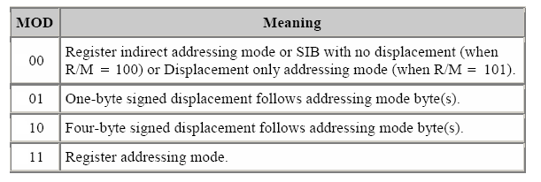

# DecodeOpcode_x86
I have developed a small method to decode x86 opcodes I have not implemented all the MODs here is what I have implemented:

d-bit check
Checking the mod
Field RM check

I implemented the MOD register addressing mode (11)
i have just implemented 32 bits table
Here is a table of the different modes



Opcode example using register adressing mode

```
0x89 0xe5
0x01 0xd0
```

Example using my class with r_mod enable
```ruby
opcode_decode = OpcodeDecode.new([0x01, 0xd0], iarch=32)

puts opcode_decode.convert_opcode_to_instruction
# => add eax, edx
```

```ruby
opcode_decode = OpcodeDecode.new([0x89, 0xe5], iarch=32)

puts opcode_decode.convert_opcode_to_instruction
# => mov ebp, esp
```

Exemple using my class with r_mod disable 
```ruby
opcode_decode = OpcodeDecode.new([0x55], iarch=32)

puts opcode_decode.convert_opcode_to_instruction
# => push ebp
```

```ruby
opcode_decode = OpcodeDecode.new([0xb8, 0x10], iarch=32)

puts opcode_decode.convert_opcode_to_instruction
# => mov eax, 10
```

```ruby
opcodes = [[0x55], [0x89, 0xe5], [0x01, 0xd0], [0xc9]]
opcodes.each do |opcode|
    opcode_decode = OpcodeDecode.new(opcode, iarch=32)
    puts opcode_decode.convert_opcode_to_instruction    
end
# => push ebp
# => mov ebp, esp
# => add eax, edx
# => leave
```
Example implementation deplacement 1 byte (01)
```ruby
require_relative '../lib/opcode_to_instruction'


opcodes = [[0x55], [0x89, 0xe5], [0x8b, 0x45, 0x8], [0x8b, 0x55, 0x0c], [0x01, 0xd0], [0xc9]]
assembly_instruction = []
opcodes.each do |opcode|
    opcode_decode = OpcodeDecode.new(opcode, iarch=32)
    assembly_instruction << opcode_decode.convert_opcode_to_instruction    
end

puts assembly_instruction.join("\n")
# => push ebp
# => mov ebp, esp
# => mov eax, [ebp+8]
# => mov edx, [ebp+c]
# => add eax, edx
# => leave
```
